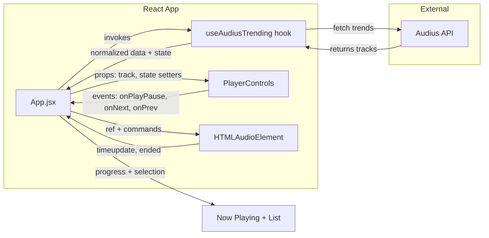

# Component + responsibility map

**Legend**
- `App.jsx` orchestrates everything (state, refs, rendering list/current track).
- `useAudiusTrending` isolates data fetching and normalization.
- `PlayerControls` is a pure presentational component emitting events through props.
- `HTMLAudioElement` represents the DOM audio tag controlled via refs.
- `Audius API` is the only external dependency.
